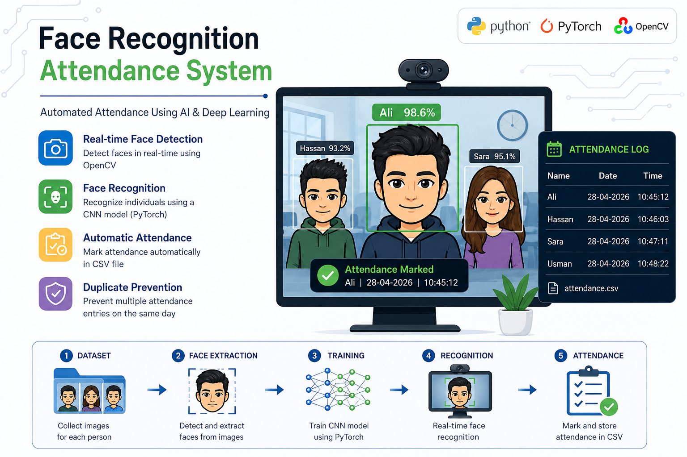

# Face Recognition Attendance System

  

## 📌 Overview
The Face Recognition Attendance System is an AI-based project that automates attendance marking using facial recognition technology. It detects and identifies individuals through a camera feed and records their attendance in real time.

---

## 🚀 Features
- Real-time face detection and recognition  
- Automatic attendance marking  
- Secure and efficient system  
- CSV-based attendance storage  
- Easy-to-use interface  

---

## 🛠️ Technologies Used
- Python  
- OpenCV  
- PyTorch / TensorFlow (if used)  
- NumPy  
- Face Recognition / CNN Model  
- CSV for data storage  

---
